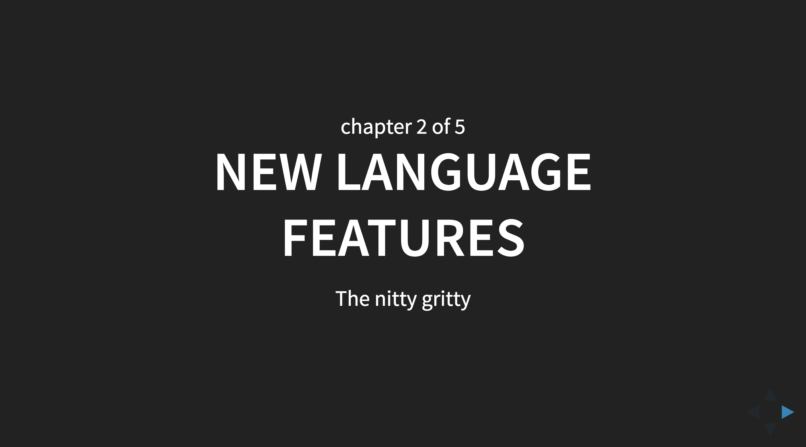

### Weee! 

Hei Klas! :D

Ok, so, detta är en overview över vilka olika "delar" som ingår i kursslides, för att ge dig en chans att komma med kloka tankar om hur det kan bli mindre fult.

Exakt samma källmaterial används också för att generera en print-pdf, men att styla den blir ett separat projekt

### Kursnavet

To get started; en **kurs består av flera kapitel**, och **varje kapitel består av flera sektioner**.

Det första man möts av är ett **nav för kursen** som visar titel och samtliga kapitel. Den fungerar som ett nav - man klickar här för att komma till ett kapitel, kör kapitlet, återkommer sedan hit för att klicka på nästa, etc.

### Kapiteltitel

Inuti ett kapitel så möts man först av dess **titelsida**. Den visar titel samt "tagline".

### Kapitelindex

Därefter kommer ett index som visar vilka sektioner som ingår i kapitlet

### Sektionstitel

En sektion börjar med en slide som visar titel och tagline (väldigt likt kapiteltitel med andra ord)

### Kapitelstruktur

Här har jag zoomat ut för att du ska kunna se hur man navigerar genom kapitlet. Vi går horisontellt åt höger mellan sektionerna, och vandrar sedan vertikalt nedåt genom varje sektion. Ascoolt, strukturen blir ruggigt tydlig.

### Innehåll - lista och nyckelord

Nu följer några exempel på slides med olika sorters innehåll. Denna har en **punktlista** (hyfsat vanligt förekommande), samt en **markering** (vilket jag använder alldeles för ofta).

### Innehåll - länk

Här ett exempel på en **länk**. Som synes har jag knappt stylat den alls, så den blir väldigt lik **markeringen**.

### Innehåll - kodblock

Här syns ett kodblock. Det finns ett antal olika CSS-teman för dem, så detta har jag inte gjort själv. Man kan välja mellan många olika (eller bygga eget). För att enkelt kunna se de olika, gå till [https://highlightjs.org/static/demo/](https://highlightjs.org/static/demo/) och klicka på olika "styles" i vänsterkolumnen. Väldigt enkelt för mig att byta ifall du hittar ngn bättre där.

### Innehåll - diagram

Jag använder ett verktyg för att generera flödesdiagram, förekommer väldigt ofta i mina slides. Det blir svg-grafik, så är kustomiserbart. Förslag på typsnitt / färg / form mottages tacksamt! Obs - jag "programmerar" diagrammen, så superenkelt att få dem att se annorlunda ut.

En till just because:

### Innehåll - frågor och svar

Ibland kör jag med att en slide ställer en pedagogisk fråga, som nästa besvarar. Dessa slides får speciella klasser som jag kan targeta med CSS. I dagsläget ser frågorna ut så här:

och svaren så här:

Min fantasi vet inga gränser.

### Innehåll - sidnummer

I en tidigare variant av slidemotorn så experimenterade jag med att visa vilket kapitel/sektion/sida vi är på just nu. Detta visas också i det printade materialet.

Just nu så visar jag det inte längre i slidsen eftersom det blev för stökigt, men kanske med lite bättre design? Or we could just leave it out.

### Kom just på!!

Förresten! Kursen jag körde i Sthlm för någon vecka sedan ligger online, du kan själv bläddra i den [här](http://blog.krawaller.se/academyjs/slides/). 

